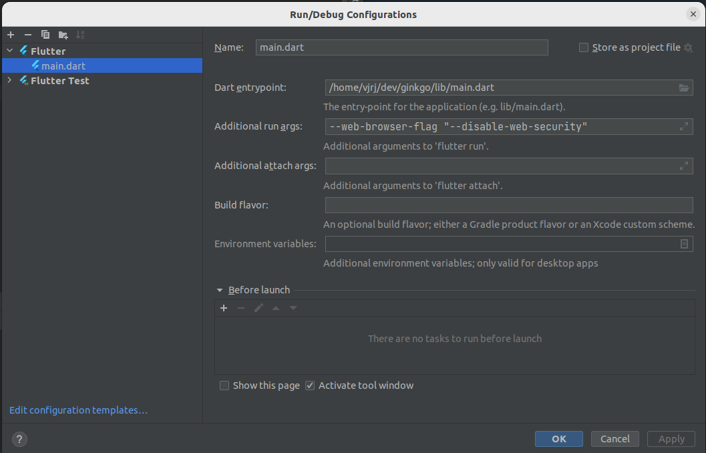
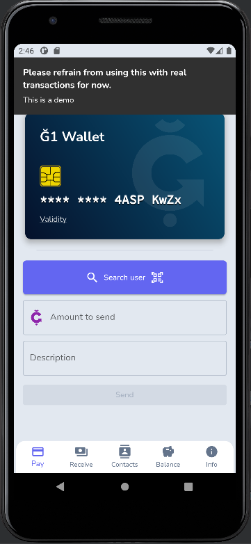
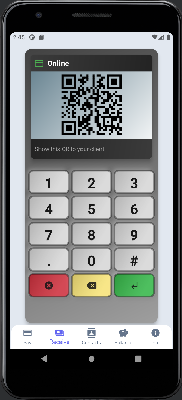

# Ğ1nkgo

 

Ğ1nkgo (aka Ginkgo) is a lightweight Ğ1 wallet for Duniter v1 written in Flutter. The app allows
users to manage their Ğ1 currency on their mobile device using just a browser.

## Features

* Introduction for beginners
* Generation of Cesium wallet and persistence (if you refresh the page, it should display the same
  wallet address).
* A point-of-sale device that generates a QR code for the public address and other QR codes with
  amounts (which lightweight wallets will understand).
* Send Ğ1 transactions
* Transactions history page and Balance with persistence to load last transactions on boot
* Contact management and cache (to avoid too much API petitions)
* Internationalization (i18n)
* QR code reader
* Import/export of your wallet
* Automatic discover and selection of nodes, error recovery & retry
* Customizable via [env file](https://git.duniter.org/vjrj/ginkgo/-/blob/master/assets/env.production.txt)
* Inline tutorials
* Pagination of transactions
* Some contextual help (for example, by tapping on "Validity").

## Demo

This is a demo used for testing a development, please use a production server for stability:

[https://g1demo.comunes.net/](https://g1demo.comunes.net/)

## Ğ1nkgo in production

- [https://g1nkgo.comunes.org](https://g1nkgo.comunes.org)
- (...)

## Translations

First of all, you can contribute translating Ğ1nkgo to your language:

[https://weblate.duniter.org/projects/g1nkgo/g1nkgo/](https://weblate.duniter.org/projects/g1nkgo/g1nkgo/)

## Docker

mkdir -p ~/.ginkgo/nginx-conf
mkdir -p ~/.ginkgo/www 

## Dev contributions

### Prerequisites

This repository requires [Flutter](https://flutter.dev/docs/get-started/install) to be installed and
present in your development environment.

Clone the project and enter the project folder.

```sh
git clone https://git.duniter.org/vjrj/ginkgo.git
cd ginkgo
```

Get the dependencies.

```sh
flutter pub get
```

### Build & deploy

Something like this should work:
```
flutter test 
flutter build web --release 
rsync --progress=info2 --delete -aH build/web/ youruser@yourserver:/var/www/ginkgo/
```

### Run dev environment

Run the app via command line or through your development environment.

```sh
flutter run lib/main.dart
```

In order to do gva operations, you should disable cors in the flutter run config:

```
--web-browser-flag "--disable-web-security"
```



### Pub packages used

This repository makes use of the following pub packages:

| Package                                                             | Version | Usage                                                |
|---------------------------------------------------------------------|---------|------------------------------------------------------|
| [Durt](https://pub.dev/packages/durt)                               | ^0.1.6  | Duniter crypto lib                                   |
| [Bloc](https://pub.dev/packages/bloc)                               | ^8.1.0  | State management                                     |
| [Flutter Bloc](https://pub.dev/packages/flutter_bloc)               | ^8.1.1  | State management                                     |
| [Hydrated Bloc](https://pub.dev/packages/hydrated_bloc)             | ^9.0.0  | Persists Bloc state with Hive                        |
| [Equatable](https://pub.dev/packages/equatable)                     | ^2.0.5  | Easily compare custom classes, used for Bloc states* |
| [Flutter Lints](https://pub.dev/packages/flutter_lints)             | ^2.0.1  | Stricter linting rules                               |
| [Path Provider](https://pub.dev/packages/path_provider)             | ^2.0.11 | Get the save path for Hive                           |
| [Flutter Displaymode](https://pub.dev/packages/flutter_displaymode) | ^0.5.0  | Support high refresh rate displays                   |
| [Easy Localization](https://pub.dev/packages/easy_localization)     | ^3.0.1  | Makes localization easy                              |
| [Hive](https://pub.dev/packages/hive)                               | ^2.2.3  | Platform independent storage.                        |
| [Url Launcher](https://pub.dev/packages/url_launcher)               | ^6.1.7  | Open urls in Browser                                 |
| [Ionicons](https://pub.dev/packages/ionicons)                       | ^0.2.2  | Modern icon library                                  |

### Easy Localization

To add translations, add it to `assets/translations` and enable it in `main.dart`. Also go
to [ios/Runner/Info.plist](./ios/Runner/Info.plist) and update the following code:

```
<key>CFBundleLocalizations</key>
<array>
  <string>en</string>
  <string>es</string>
  <string>fr</string>
  <string>ca</string>
</array>
```

``

## Screenshots

| Wallet                                                                         | Terminal card                                                                    |
|--------------------------------------------------------------------------------|-------------------------------------------------------------------------------|
|  |  |

## Credits

### Translations

- ast: dixebral
- ca: calbasi
- de: FW
- eu: Anna Ayala Alcalá
- fr: vincentux, poka, Hugo and Maaltir
- gl: Vijitâtman
- it: Anna Ayala Alcalá
- nl: Maria Rosa Costa i Alandi
- pt: Carlos Neto

Thanks!

### Others

- Ğ1 logos from duniter.org
- undraw intro images: https://undraw.co/license
- Chipcard https://commons.wikimedia.org/wiki/File:Chipcard.svg under the Creative Commons
  Attribution-Share Alike 3.0 Unported license.
- [POS svg from wikimedia](https://commons.wikimedia.org/wiki/File:Card_Terminal_POS_Flat_Icon_Vector.svg) CC-BY-SA 4.0

Thanks!

## License

GNU AGPL v3 (see LICENSE)
